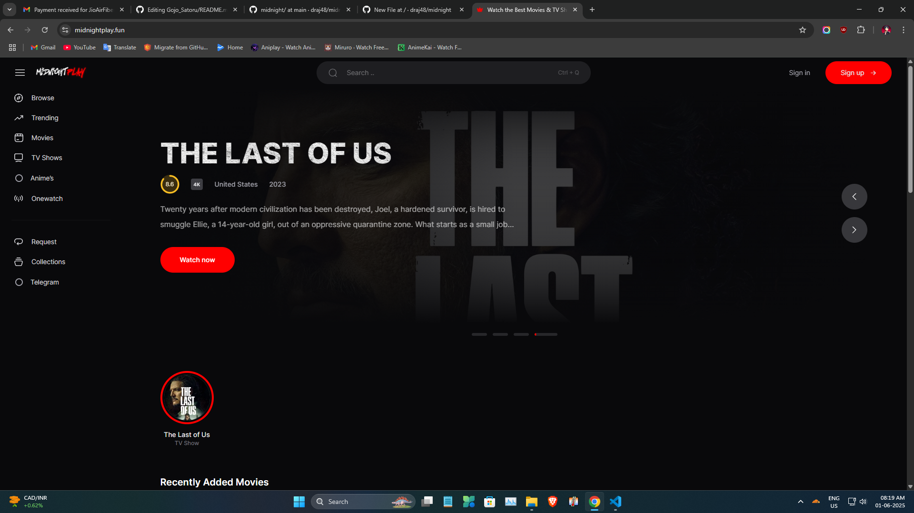
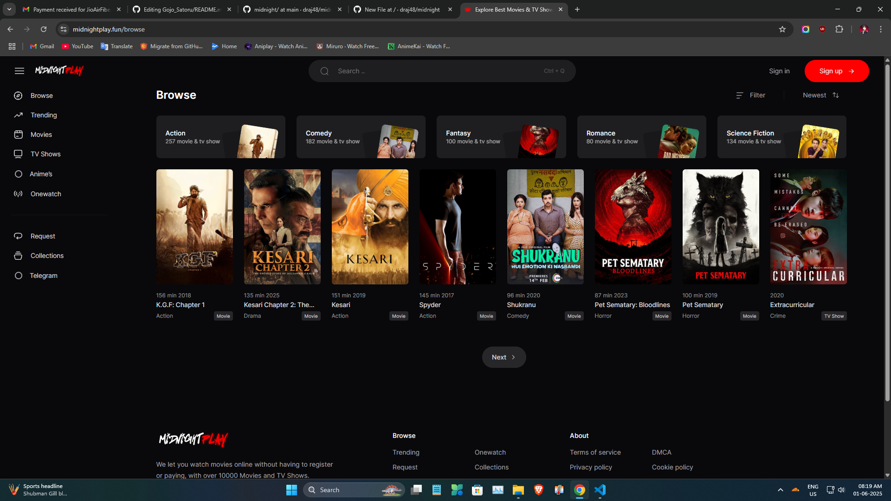
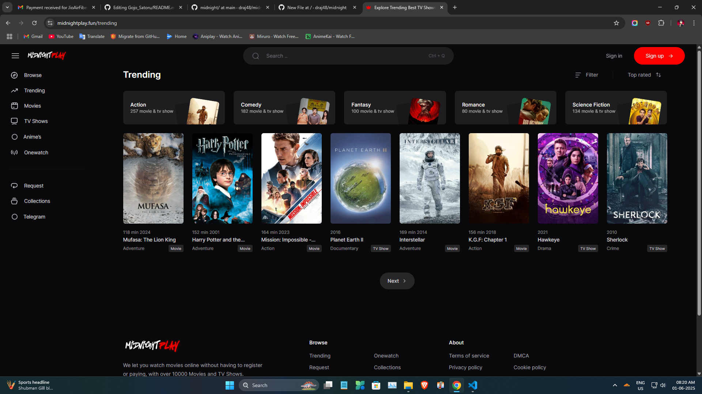
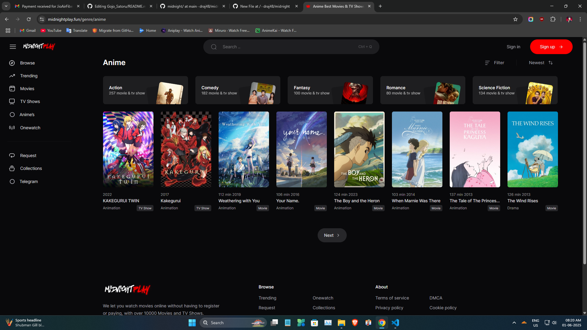

<h1 align="center">
  <b> MidnightPlay </b>

  
<h3 align="center"></h3>
<h3 align="center"></h3>
<h3 align="center"></h3>
<h3 align="center"></h3>

------

<!--  -->

<!--  -->

**A php based streaming OTT platform.
If you like the project make sure to give a ⭐ __star__ ⭐ to this respository and feel free to updating and sending pull requests**

---------  

## Inspiration ✨
this code base on Wovie

## Stream Server

 /app/Livewire/WatchComponent.php

<h8/> $this->videos[] = [
 'label' => 'VidScr',
 'type' => 'embed',
 'link' => 'https://vidsrc.to/embed/movie/' . $listing->tmdb_id,
 ]; </h8>

## Requirements
  
* PHP Version >= 7.1.3
* PDO PHP Extension Enabled
* MySQL Database

*** Note: I have not created this code myself, it was created by Codelug, I have just modified it because the original developer has not been updating it for a long time. ***
  
***Can be found on discord as __[DRAJ](https://discord.gg/6u7gagxSFD)__***
  

